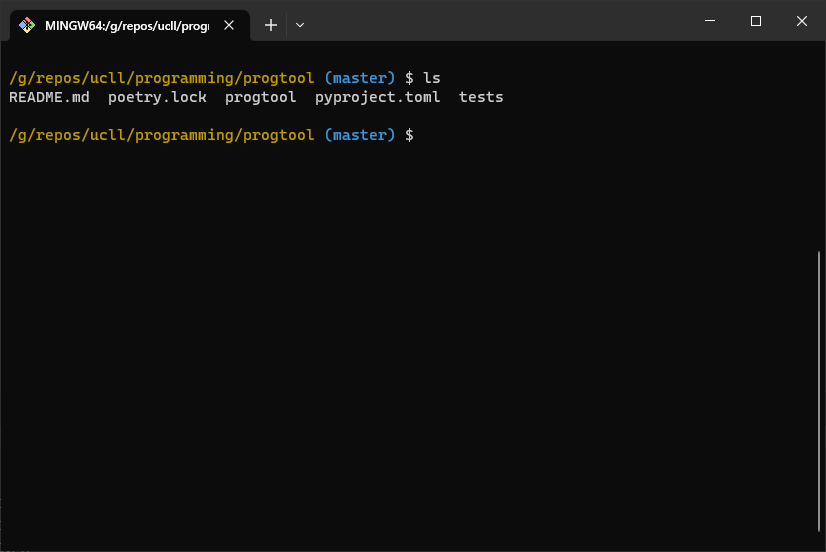
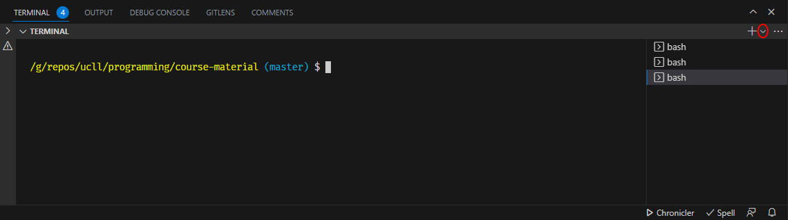

# Shell

A [shell](https://en.wikipedia.org/wiki/Shell_(computing)) is a piece of software that allows us to communicate with the operating system.
For example, on Windows, the desktop, the taskbar and File Explorer all are part of Windows's shell.

However, there's also the command line interface.
This is a text-based way of interacting with your OS.
For example, instead of using File Explorer to view your files, you use the `ls` command.



From now on, when we talk about the shell (or the terminal), we mean this command line interface.

## Multiple Shells

A text-based shell is an application just like any other.
Anyone can make their own shell, which is why there are many choices around:

* [cmd.exe](https://en.wikipedia.org/wiki/Cmd.exe) is severely outdated and should really be avoided.
* [PowerShell](https://en.wikipedia.org/wiki/PowerShell)
* [Bourne-Again Shell (Bash)](https://en.wikipedia.org/wiki/Bash_(Unix_shell))
* [Z shell](https://en.wikipedia.org/wiki/Z_shell)

We suggest you rely on Bash (Windows and Linux) and Z Shell (MacOS).

## Launching the Shell

Visual Studio Code allows you to run the shell inside it:

* Open the Terminal menu.
* Select New Terminal.

Make sure to select the right shell.
You can control which shell is created using the little arrow next to the + button.




## Python Shell

Python has a shell of its own.
It allows you to type in Python commands, which are then executed on the spot.

You can launch the Python shell from the "regular" shell using `py`, `python` or `python3`, depending on your OS.

```python
$ py
Python 3.11.2 (tags/v3.11.2:878ead1, Feb  7 2023, 16:38:35) [MSC v.1934 64 bit (AMD64)] on win32
Type "help", "copyright", "credits" or "license" for more information.
>>>

```


### IMPORTANT
The OS shell and the Python shell are two completely different beasts.
Do not confuse the two!


```bash
$ some OS shell command to type in
```


```python
>>> some Python code
```


