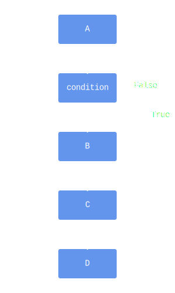

# If

Some instructions only need to be executed when certain conditions are satisfied.

- Award a point only _if_ the answer to the question is correct.
- Give discount only _if_ the order amounts to more than &euro;100.
- Show emails only _if_ password is correct.

Python provides the [_`if` statement_](https://docs.python.org/3/tutorial/controlflow.html#if-statements) to allow you to specify that certain instructions should be executed conditionally.

```python
instruction A

if condition:
    instruction B
    instruction C
    # ...

instruction D
```

The code above can be visualized as follows:



When Python encounters an `if` statement, it will evaluate the `condition`.
If it evaluates to `True` (or some truthy value, see later), the instructions inside the `if` (the indented lines) will be executed.
If, however, `condition` evaluates to `False` (or some falsey value, see later), these instructions will be skipped and execution proceeds with whatever follows the `if` statement.

## Return

Up until now, your functions have consisted for a series of instructions ending in a `return` statement.
Consider the following code:


```python
if condition:
    return 1
return 2
```

As you can see, it is possible to have `return` statements inside an `if` statement.
It is important for you to know that a `return` statement cuts short the execution of a function.
In other words, the moment execution encounters a `return`, all other instructions in that function are skipped.
This means that in the code shown above, if the `condition` evaluates to `True`, `1` will be returned.

## Truthy and Falsey Values

Ideally, the `if`'s `condition` evaluates nicely to `True` or `False`.
Some language insist on that and will report an error if you present the `if` with any other value.
Python, however, is more flexible and allows any value, such as integers or any of the other types of values we'll encounter in the future.

So, what happens were you to write this code?

```python
if 5:
    instruction
```

Python makes the distinction between _truthy_ and _falsey_ values.
A truthy value is any value that will be interpreted as `True` when used in an `if`.
Likewise for falsey values, which will be considered `False`.

This raises the question, is `5` a truthy value, or a falsey one?
In the case of integers, all of them are truthy, except for `0`, which is falsey.
So in the example above, `instruction` will be executed.
