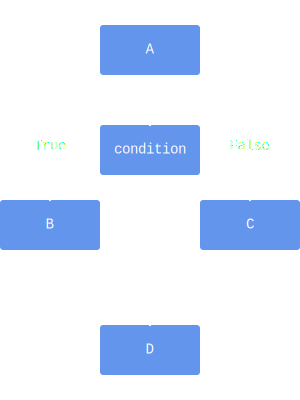

# If Else

It often happens that you want some series of instructions to be executed when some condition holds, but some other series of instructions if the condition does not hold.
You can write this as


```python
instruction A

if condition:
    instruction B

if not condition:
    instruction C

instruction D
```


There is a shorter, more efficient way to achieve the same:


```python
instruction A

if condition:
    instruction B
else:
    instruction C

instruction D
```


Visualized, this is equivalent with



