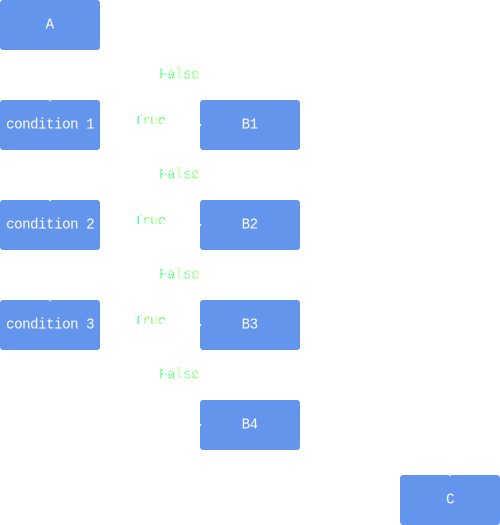

# Elif

An `if` can be seen as a fork in the road: you can either go "left" or "right".
Sometimes, however, there are more than two execution paths to choose from.

Say, for example, you are writing a chess game and need a function that determines if a move is valid.
Whether a move is valid depends on the piece: pawns, rooks, knights, bishops, queens and kings all have a different movesets.
Your function will have to differentiate between all the different pieces.

```python
if piece_type == pawn:
    # deal with pawn
else:
    if piece_type == rook:
        # deal with rook
    else:
        if piece_type == knight:
            # deal with knight
        else:
            if piece_type == bishop:
                # deal with bishop
            else:
                if piece_type == queen:
                    # deal with queen
                else:
                    # deal with king
```


While technically correct, this is quite awkward to write.
Luckily, there's a cleaner solution:


```python
if piece_type == pawn:
    # deel with pawn
elif piece_type == rook:
    # deel with rook
elif piece_type == knight:
    # deel with knight
elif piece_type == bishop:
    # deel with bishop
elif piece_type == queen:
    # deel with queen
else:
    # deal with king
```


As you can see, using a `if-elif-else`, you can easily deal with different execution paths.
More generally,


```python
instruction A

if condition 1:
    instruction B1
elif condition 2:
    instruction B2
elif condition 3:
    instruction B3
else:
    instruction B4

instruction C
```


can be visualized as




### `IMPORTANT`
Only one of the branches will be executed, namely the first one whose condition evaluates to a truthy value.

For example,


```python
x = 5

if x > 3:
    result = 1
elif x > 4:
    result = 2
else:
    result = 3
```

Here, `result` will end up with the value `1`.
