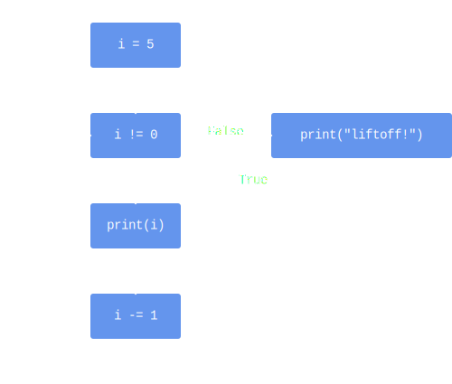

# While Loop

Algorithms are built out of three kinds of building blocks.
You've already met two of them:

* Sequencing, i.e., having steps be executed one after the other, in order.
* Selection, i.e., being able to specify whether certain steps should be either executed or skipped based on a condition.
  In Python, selection takes the form of an `if`.

The last building block is *iteration*.
This construct allows us to *repeat* certain steps for as long as we want.

Here's an example:

```python
i = 5

while i != 0:
    print(i)
    i -= 1

print("liftoff!")
```

Python has multiple ways to perform iteration.
In the code above, we are using a *while loop*.
The *body* of the while loop, which consists of the `print(i)` and `i -= 1` statements, is repeated for as long as the condition `i != 0` is true.

We can visualize this code using a flowchart:




Let's go through the code step by step:

* We initialize `i` to `5`.
* We arrive at the `while` loop.
  The condition `i != 0` is evaluated; this yields `True`.
  Because the condition is true, the loop's body gets evaluated.
  * The value of `i` is printed, i.e., `5`.
  * `i` gets decremented by `1` and is now equal to `4`.
* Execution jumps back to the `while` line.
* The condition is re-evaluated: is `i` still not equal to `0`?
  The answer is yes, causing the loop body to be executed a second time.
  * The value if `i` (`4`) is printed.
  * `i` gets decremented from `4` to `3`.
* We jump back to the `while` line.
  This process keeps getting repeated:
  * `3` is printed and `i` goes from `3` to `2`.
  * `2` is printed and `i` goes from `2` to `1`.
  * `1` is printed and `i` goes from `1` to `0`.
* `i` has reached `0`.
  The condition is, once again, evaluated, but this time it yields `False`.
* Because the condition is not true anymore, the iteration ends, i.e., the loop body won't get executed again.
* We end up at the last `print`, which outputs `"liftoff!"`.

### `IMPORTANT`
Some students are under the impression that the condition is reevaluated after every step in the loop.


```python
i = 0
while i != 1:
  i = 1
  i = 0
```

This is an *infinite loop*.
Every time the condition is checked, `i` equals `0`.

Even though `i` gets set to `1` inside the loop's body, it doesn't matter: the condition is only checked after a *full* iteration.
Intermediate values for `i` have no bearing on the loop.
::::

## `return`

As mentioned a while back, `return` immediately exits the function.
This is also true for loops: if you have a `return` inside your loop, it will interrupt the loop.

### `EXAMPLE`


```python
def loop():
    i = 0
    while i < 10:
        print(i)
        if i == 5:
          return
        i += 1
```


will only print the numbers from `0` to `5`.


