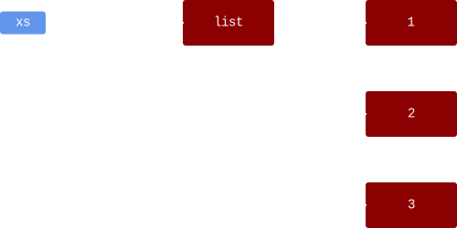
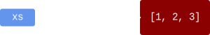

# References

By now, we discussed many different kinds of values or objects (in Python these terms are synonymous):

* Integers, e.g., `0`, `1`, `2`
* Floating point numbers, e.g., `0.1`, `3.1415`
* Booleans, e.g., `True` and `False`
* Strings, e.g., `"hello"`
* Tuples, e.g., `(1, 2, 3)`

All these objects are *immutable*, or *stateless*, meaning you cannot change them.

Lists, however, are the first type of object we've encountered that we can *modify*.
We say that lists are *mutable*, or *stateful*.
This brings us to *object identity*, a concept that becomes relevant when dealing with state.

### `INFO`
The distinction between working with stateful objects and stateless objects is an important one, important enough to assign names to the two styles:

* *Imperative programming* involves mostly stateful objects, but stateless objects are allowed.
* *Functional programming* allows only stateless objects.

Recently, the world has moved towards functional programming, as it simplifies things a lot.
:::

## Example: Lists

Consider the following code:


```python
xs = [1, 2, 3]
ys = [1, 2, 3]
```

 Are `xs` and `ys` the the same list?

* On the one hand, one could claim that `xs` and `ys` are the same: they're both lists, and they contain the same elements.
  How more "the same" can you get?
* On the other hand, we could say they're different lists.
  We can add an element to `xs` and it will not appear in `ys`.

They're two different answers to the same question.
For this reason, Python offers two different ways to check for equality.

* `xs == ys` checks that `xs` and `ys` have the same kind of objects and if they have the same contents.
  In our case, `xs == ys` yields `True`.
* `xs is ys` checks whether they're actually the same object.
  In our case, `xs is ys` yields `False`: they're distinct lists.

## Memory Layout

Looking at how things are stored in your computer's memory may make things clearer.

Everything has to be stored somewhere in memory (RAM): every int, boolean, string, functions, ...
In order to access something stored in memory, you need to know *where* it is located.
This is possible using *memory addresses*.
Without the address, you don't know where the object resides in memory, and therefore you cannot reach it.

The term "memory address" is seldomly used when using high level programming languages like Python, JavaScript, Java, etc.
Instead, the term "reference" is used, but in essence it is the same.
From now on, we'll be using "reference" exclusively.

So what happens when we write `x = 5`?

* Some memory is allocated, enough to store the value `5` in.
* `x` is a variable, which can be thought of as a box.
  A *reference* to `5` is put inside this box.

We can visualize this as follows:


Now let's create a list:

```python
xs = [1, 2, 3]
```

If we visualize the memory layout, we get




As you can see, the list also contains references.
To make the diagrams more manageable, we can simplify this visualization to




It is important, however, that you realize that this representation is just a simplification and that the first diagram shows the actual memory layout.

Let's introduce a second list:


```python
xs = [1, 2, 3]
ys = [1, 2, 3]
```


This diagram makes it clear that although `xs` and `ys` refer to "the same" list, these lists are actually distinct entities in memory.
`xs == ys` is `True`, but `xs is ys` is `False`.

## Assignment

We now examine the following code:


```python
xs = [1, 2, 3]
ys = xs
```


When you assign one variable (`xs`) to another (`ys`), as shown above, the contents of `xs` is copied to `ys`.
As mentioned before, the contents of `xs` is a *reference* to a list `[1, 2, 3]`, so it is the *reference* that is being copied.


As the diagram shows, both `xs` and `ys` refer to the same list object.


```python
>>> xs = [1, 2, 3]
>>> ys = xs
>>> xs.append(4)
>>> xs
[1, 2, 3, 4]

>>> ys
[1, 2, 3, 4]


>>> xs == ys
True

>>> xs is ys
True
```


`xs.append(4)` starts at `xs`, follows the arrow and ends up at the list `[1, 2, 3]`.
It then adds `4` to this list.
Since `ys` refers to the exact same list, it should come as no surprise that printing out the contents of `ys` yields `[1, 2, 3, 4]`.

## Terminology

In order to be able to express ourselves unambiguously, we introduce the following terminology:

* Two objects `x` and `y` are *equal* if `x == y` is `True`.
* Two objects `x` and `y` are *the same* if `x is y` is `True`.

## Relationship with Mutability

We started this explanation about mutability.
But what does this have to do with references?

When working with immutable objects, the distinction between equal objects and same objects does not matter: the results will always be the same.
However, when mutable objects are involved, it can be crucial to keep the distinction in mind.
