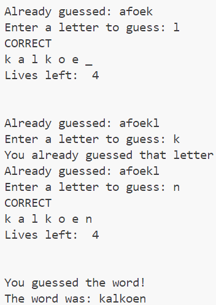

# Assignment Hangman

### You should know
- Arithmetic, functions
- Booleans, conditionals, None
- Strings
- Loops

## Hangman
Make a script to play hangman using the building blocks you already learnt during this course. Write the script step by step, by identifying the necessary information and game flow. 
Tip: Playing the game might be of great help!

### Game rules
Hangman is a guessing game for two or more players. One player (game master) thinks of a word and the other(s) tries to guess it, by suggesting letters, within a certain number of guesses. 

The word to guess is represented by a row of dashes indicating each letter or number of the word. Rules may permit or forbid proper nouns, such as names, places, brands, or slang. If the guessing player suggests a letter which occurs in the word, the game master writes it in all its correct positions. If the suggested letter does not occur in the word, the game master adds (or alternatively, removes) one element of a hanged stick figure as a tally mark. Generally, the game ends once the word is guessed, or if the stick figure is complete — signifying that all guesses have been used.

### Requirements
*	The game is played on one device. The game master initializes the game, the player(s) continue(s) playing. Multiple players play as a team and will be refered to as player. 
*	The game master has to choose a word for the player to guess and the number of lives a player gets.
*	Every time the player guesses a wrong letter, they lose a life.
*	They can only guess letters, one at a time, capitals are irrelevant.
*	If they guess a letter they already guessed, no lives are lost and the game continues. Display a message.
*	If the player wants to quit during the game, they should be able to type “stop” at certain points.
*	Display the secret word using _ (f.e: tennis: _ _ _ _ _ _)
*	When a letter is guessed, remove the corresponding _ and display the letter
(f.e.: t _ n n _ _).
*	Ensure the player knows what is going on during the game by providing enough textual information.

EXTRA
* Print the letters a player already guessed when making a new guess.
* Ask the player to play a new game (using loops)
* Keep track of the wins and losses of the player.
* Display a hangman while playing

    
  Getting started

If you find it hard to start programming the game, it is useful to write down the actions the player does when playing the game. Play the game and list all actions in comments. Make a first structure of the game (loop).

If you still find it hard to start programming, you can open the section below.

    
  Questions to get you started

#### Setup
* What essential information do we need before starting the actual game?
* How do we get this information?
* Other information we might want to store?

--> Check the instructions!

#### Guess game loop
* What information do you get from the instructions about the guessing part? What are the requirements? List them in bullet points using commands (#). (We will structure a sperate section for checking whether the letter is in the word or not, so you can take that as one bullet point.)

#### Check letter in word
* What happens when the user guesses a correct letter?
* What happens if the user guesses a letter which does not occur in the word?

#### End of the game
* When does the game end? 

If you have listed all the answers, you have a structure to start programming the game. Break the exercise into pieces.

    
  Example output

