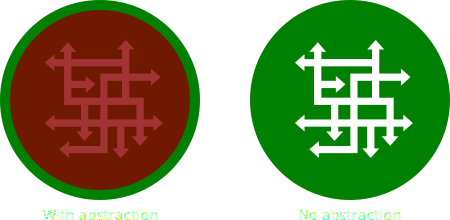

# Introduction

Programming languages provide us with a small set of basic data types.
Typically, this is what you get:

* Integers
* Floating Point Numbers
* Booleans
* Strings

However, there are many other kinds of objects we would like to represent, depending on the software we're building:

* A calendar app needs objects to represent dates, meetings, birthdays, &hellip;
* A strategy game needs a map, different kinds of units, resources, &hellip;
* A web shop involves an item catalog, a shopping basket, orders, customers, &hellip;

We've seen that we can group related data together, e.g., with tuples.
Technically, this is more than sufficient to satisfy all of our software building needs: we can model arbitrarily complex data simply by introducing more tuples and putting these tuples in other tuples.
Ultimately, we'll end up with [tuples 20 deep](https://youtube.com/shorts/qjwYrBo5vy4), but hey, it works.

However, we have to consider the human factor.
While a machine has no trouble following instructions describing how to work with complex data, humans are still the ones who have to write down those instructions.
And humans are notoriously bad at dealing with such complexity.

Fortunately for us, programming languages provide ways to reduce this complexity through the use of *abstraction*.

## Abstraction

Abstraction is part of our daily lives: our brains use it to make interacting with the world manageable.
When you work on your laptop, you interact with it on a very high level of abstraction: you type on your keyboard and letters "magically" appear, you use your mouse or trackpad to move the cursor around and click on different GUI elements.
While doing so, you're not thinking of the billions of instructions that are being executed by your laptop to render fonts, process data, play music, etc.
You think even less about the logic gates built out of transistors on your CPU that furiously manipulate electrical signals that represent bits.
And you certainly don't think about changes in quantum fields as spinny muons and charming leptons (or whatever those things are called) buzz around.
Abstraction is all about hiding details and only focusing on the things that matter.

Back to the programming world.

Functions are actually a basic form of abstraction (functions were even originally called [abstractions](https://en.wikipedia.org/wiki/Lambda_calculus#lambdaAbstr).)
Take `print("Hello")` for example: internally, printing to the screen is quite an elaborate process that involves millions of instructions.
But that doesn't interest you.
The only thing you care about is that `Hello` appears on the screen.
There are only three things you need to know about `print`:

* Its name.
* Its parameters.
* Its return value.

This is called its *public interface*.
A function also contains a set of instructions, but those are implementation details and are *private*.

The problem with using tuples to model objects is that, contrary to functions, they fully expose their internal details.
We can visualize this as follows:

What we need is to make the complexity private (red) and only wrap it inside a simple public interface (green).

## Safety

Abstraction can also provide safety.
Take, for example, a television.
It contains plenty of electronics, but you're not supposed to touch those.
Instead, the television comes with "public interface", i.e., a remote control.
All interactions with your television should go through this remote control.

If the television is well made, there is no combination of remote control buttons you could press that would *break* the television.
The remote control should be 100% safe to use.

However, tinkering with the internals of the television is a lot riskier.
Even though you could probably change the channel by prodding the right circuit, prodding the wrong circuit could break your television.

The same is true with code.
The public interface should be made in such a way that

* it's easy to use; and
* it cannot break the object.

In later sections, we'll give you more concrete examples.
